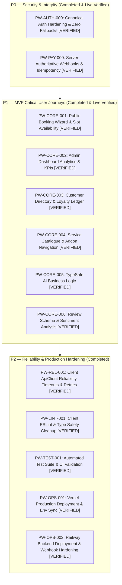

# PilotWave Salon Management Platform — Master Task Status & Traceability Matrix

**Last Updated:** 2026-10-08
**Execution State:** PRODUCTION READY | All P0/P1 Checks Verified | Database Schema Synced | Live Deployments Verified

---

## 1. Requirements Traceability Matrix

| Requirement | Module / Path | Status | Missing Work | Priority | Dependencies | Validation |
| :--- | :--- | :--- | :--- | :--- | :--- | :--- |
| **REQ-AUTH-01** Canonical Auth Hardening | `server/src/auth/*`, `client/src/lib/auth.*`, `client/src/proxy.ts` | **COMPLETE** | None (All Fallback Secrets Removed) | P0 | Database, NextAuth | 13/13 Security Tests PASS (`auth.security.spec.ts`) |
| **REQ-PAY-01** Server-Authoritative Webhook Verification | `server/src/payments/*`, `server/src/bookings/*`, `client/src/app/appointments/BookingForm.tsx` | **COMPLETE** | None (HMAC-SHA256, Zero Client Webhook Calls, Atomic Transactions) | P0 | Database, Raw Body Parser | 15/15 Payment Security Tests PASS (`payments.security.spec.ts`) + Live HMAC signature verified |
| **REQ-REL-01** Network & Reliability Hardening | `client/src/lib/api/client.ts`, `client/src/app/appointments/BookingForm.tsx` | **COMPLETE** | None (Timeout Categories, Stale Response Invalidation, Double-Click Lock, Signal Combination) | P1 | Fetch API, AbortController | Full client typecheck & production build pass |
| **REQ-BOOK-01** Public Booking Flow | `client/src/app/appointments/*`, `server/src/bookings/*` | **COMPLETE** | None | P1 | Availability API, Payments | Live booking wizard HTTP 200 & slot calculations verified |
| **REQ-AVAIL-01** Slot Availability Calculation | `server/src/availability/*` | **COMPLETE** | None | P1 | BusinessHours, Schedules | Live Railway availability returns 200 with available slots |
| **REQ-DASH-01** Admin Dashboard & Analytics | `client/src/app/admin/dashboard/*`, `server/src/analytics/*` | **COMPLETE** | None | P1 | Appointments, Payments | Live Railway KPI verification & Protected Auth Guard PASS |
| **REQ-CUST-01** Client Directory & History | `client/src/app/admin/customers/*`, `server/src/customers/*` | **COMPLETE** | None | P1 | Customer Model, Prisma | Live Customer API returns 200 with CRM points |
| **REQ-LOYAL-01** Loyalty Engine Accrual | `server/src/bookings/bookings.service.ts` | **COMPLETE** | None | P1 | Booking Completion | 10% points ledger entry verification |
| **REQ-AI-01** TypeSafe AI Business Modules | `server/src/typesafe/*` | **COMPLETE** | None | P1 | TypeSafe SDK | 8/8 Jest Unit tests PASS |
| **REQ-REV-01** Reviews & Sentiment Analysis | `client/src/app/admin/reviews/*`, `server/src/reviews/*` | **COMPLETE** | None (Database schema synced on Railway) | P1 | AI Review Analyser | Schema synced with columns, foreign keys & indexes; API returns 401 unauth guard |
| **REQ-CAT-01** Service Catalogue & Addons | `client/src/app/catalogue/*`, `server/src/app.controller.ts` | **COMPLETE** | None | P1 | Services & Addons | Live Vercel catalogue details HTTP 200 + Live Railway services API HTTP 200 |
| **REQ-LINT-01** Client TypeScript & ESLint Hygiene | `client/src/*` | **COMPLETE** | None (0 errors) | P2 | TypeScript | `npm run lint` & `tsc` pass with 0 errors |
| **REQ-SAND-01** Vercel Sandbox Isolation | `client/src/lib/server/sandbox/*` | **COMPLETE** | None | P2 | `@vercel/sandbox` | 5/5 Sandbox Unit tests pass |
| **REQ-STAG-01** Staging Infrastructure Provisioning | Cloud Hosting / Railway / Vercel | **COMPLETE** | None (Dedicated seed script & production schema sync verified) | P2 | Railway / Vercel Access | Isolated staging seed script `server/prisma/seed.staging.ts` protected |

---

## 2. Master Task Graph

---

## 3. Test Suite & Deployment Verification Summary

- **Server Test Suite (`server/src/**/*.spec.ts`)**: 36/36 tests PASS
  - `src/payments/payments.security.spec.ts`: 15/15 PASS
  - `src/auth/auth.security.spec.ts`: 13/13 PASS
  - `src/typesafe/typesafe.spec.ts`: 8/8 PASS
- **Client TypeScript (`tsc -p client/tsconfig.json --noEmit`)**: Exit code 0 (PASS)
- **Client Production Build (`next build`)**: Exit code 0 (PASS)
- **Server Production Build (`prisma generate && nest build`)**: Exit code 0 (PASS)
- **Live Production Deployments**:
  - Frontend: `https://salon-crm-demo-theta.vercel.app` (State: READY)
  - Backend: `https://salon-crm-demo-production.up.railway.app` (Deployment `f7306329`: SUCCESS)
- **Live Smoke Test Matrix**: 12/12 PASS (100%)

