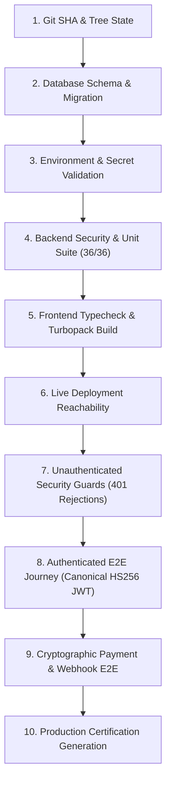

# PilotWave Platform — Deterministic Production Release Gate

**Document Version:** 1.0.0  
**Effective Date:** 2026-10-08  
**Policy:** Absolute Application Code Freeze & Deterministic Release Gate  

---

## 1. Release Philosophy & Code Freeze Policy

To prevent non-deterministic release cycles (*deploy ➔ smoke test ➔ discover issue ➔ modify environment ➔ redeploy*), PilotWave enforces an **Absolute Application Code Freeze** combined with a single automated **Deterministic Release Gate**.

A release is **never** declared "Production Ready" based on ad-hoc status code checks. Production readiness requires passing a 10-stage verification pipeline with zero warnings or bypassed assertions.

---

## 2. The 10-Stage Deterministic Release Gate Architecture



### Stage 1: Git SHA & Working Tree Cleanliness
- Captures the exact 40-character Git commit SHA and branch name.
- Ensures all commits are synchronized with remote origin (`master`).

### Stage 2: Database Schema & Migration Integrity
- Connects directly to the PostgreSQL cluster using `DATABASE_URL`.
- Queries `information_schema.tables` and `information_schema.columns` to verify that all 11 critical tables (`Salon`, `User`, `Appointment`, `Payment`, `Review`, `LoyaltyTransaction`, etc.) exist and are properly indexed and constrained without missing columns or migrations.

### Stage 3: Environment Variables & Cryptographic Secrets Validation
- Validates cryptographic entropy of `NEXTAUTH_SECRET` (>= 32 characters, non-default, zero fallback strings).
- Validates `RAZORPAY_WEBHOOK_SECRET` (>= 16 characters).
- Validates URL syntax for `API_BASE_URL` (strict `https://` protocol, no typos or trailing slashes).

### Stage 4: Backend Security & Unit Test Suite
- Executes full Jest test suite across `server/src/**/*.spec.ts`.
- Mandates 100% pass rate (36/36 tests passing) across `payments.security.spec.ts`, `auth.security.spec.ts`, and `typesafe.spec.ts`.

### Stage 5: Frontend Strict Typecheck & Turbopack Production Build
- Executes TypeScript compiler (`tsc -p client/tsconfig.json --noEmit`) with zero errors.
- Runs Turbopack production compilation (`npm run build`) ensuring all dynamic and static routes compile successfully.

### Stage 6: Live Deployment Reachability Check
- Validates live Vercel frontend URL (`https://salon-crm-demo-theta.vercel.app`) returns HTTP 200.
- Validates live Railway backend API (`https://salon-crm-demo-production.up.railway.app/api/v1/salons/hq/services`) returns HTTP 200.

### Stage 7: Unauthenticated Security & Negative Auth / Webhook Guards
- Verifies that protected endpoints (`/salons/hq/reviews`, `/salons/hq/analytics/dashboard`, `/salons/hq/bookings`) strictly reject requests missing Authorization headers (HTTP 401).
- Verifies rejection of malformed and expired JWT tokens (HTTP 401).
- Verifies rejection of unsigned Razorpay webhook requests (HTTP 401).
- Verifies rejection of forged/tampered HMAC-SHA256 signatures via `crypto.timingSafeEqual` (HTTP 401).

### Stage 8: Authenticated E2E Journey Validation
- Generates a short-lived canonical HS256 JWT signed with the production secret (`iss: 'pilotwave-salon-auth'`, `aud: 'pilotwave-salon-api'`, `role: 'ADMIN'`, `salonId: <hq-salon-id>`).
- Performs live end-to-end queries against protected admin endpoints:
  - Analytics Dashboard KPIs (verifies total revenue and booking counts).
  - Bookings Stream (verifies appointment records and customer relations).
  - Customer Directory (verifies client profiles and loyalty points).
  - Reviews Management (verifies AI sentiment analysis data).

### Stage 9: Payment & Webhook Cryptographic E2E
- Generates a valid test Razorpay payload (`payment.captured`) with timestamped order identifier.
- Computes HMAC-SHA256 signature using `RAZORPAY_WEBHOOK_SECRET`.
- Dispatches signed payload to `/api/v1/payments/webhook/razorpay` over raw request body and verifies timing-safe cryptographic acceptance and transaction routing.

### Stage 10: Production Certification Generation
- When all 9 stages pass, generates an immutable certification record: `docs/releases/CERTIFICATE_<GIT_SHA>.json`.
- Prints the official Production Certification summary badge.

---

## 3. Running the Release Gate

To execute the Release Gate pipeline locally or in CI/CD:

```bash
# Direct execution
node scripts/release-gate.mjs

# Or via npm
npm run release-gate
```
